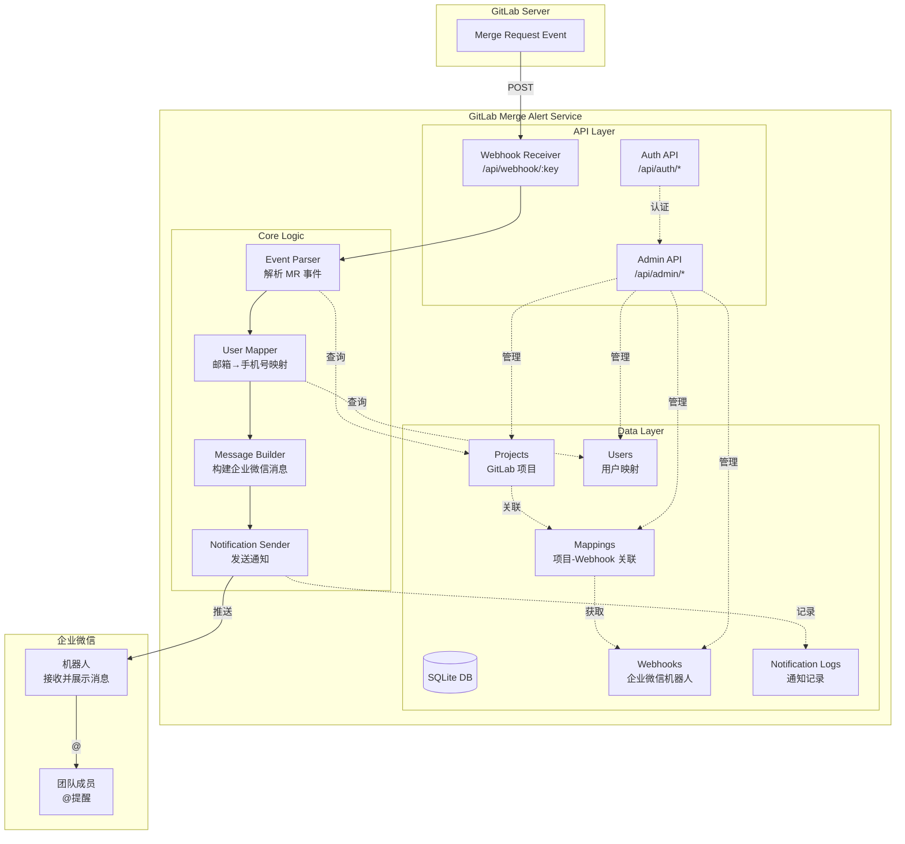

# GitLab Merge Alert - GitLab MR to WeChat Work Notification

 

> 🔔 GitLab Merge Request to WeChat Work (企业微信) notification service. Instantly notify reviewers when MR is created or updated.
>
> 将 GitLab Merge Request Webhook 转化为企业微信群通知的一站式服务，提交 MR 时立即通知审核人。
> 内置管理后台与权限体系，部署后即可投入团队协作流程。

**Keywords**: GitLab, Merge Request, MR, WeChat Work, 企业微信, Webhook, Notification, Alert, GitLab Integration, Code Review

## 主要功能

- **Webhook 到通知**：接收 GitLab Merge Request 事件，按项目推送到绑定的企业微信机器人，并支持按手机号 @ 指派人。
- **集中化管理**：后台可维护 GitLab 项目、企业微信 Webhook、用户邮箱与手机号映射以及项目与 Webhook 的关联关系。
- **部署极简**：除了在 GitLab 申请一个 Access Token，其他所有配置和操作都在本服务内完成，无需额外依赖。
- **批量项目添加**：支持一键添加 GitLab 组下的所有子项目，快速完成团队项目配置，无需逐个手动添加。
- **可观测性**：内置通知记录、概览指标以及项目 / Webhook 日统计，便于追踪推送效果。

## 核心架构



1. **事件接收**：GitLab 通过 Webhook 推送 Merge Request 事件到服务
2. **事件处理**：
   - 解析 MR 事件数据（标题、描述、作者、指派人等）
   - 查询项目配置，获取对应的企业微信 Webhook
   - 通过邮箱或用户名查找手机号，用于 @ 提醒
3. **消息构建**：根据事件类型（打开/更新/合并/关闭）生成不同的消息模板
4. **通知发送**：调用企业微信机器人 API 发送 Markdown 格式消息
5. **记录存储**：所有通知记录保存到数据库，支持后续查询和统计

## 功能展示

### 数据统计仪表板

提供直观的数据统计和可视化界面，实时掌握系统运行状况：


### 批量项目导入

支持通过 GitLab 组 URL 一键导入该组下的所有项目


## Docker 快速部署

```bash
docker run -d \
 --name gitlab-merge-alert-go \
 -p 1688:1688 \
 -v $PWD/data:/data \
 -v $PWD/logs:/logs \
 -v $PWD/config.local.yaml:/app/config.local.yaml:ro \
 alfonsxh/gitlab-merge-alert-go:last
```

- `data` 用于持久化 SQLite 数据库。
- `logs` 保存服务日志。
- `config.local.yaml` 本地配置文件（可选），用于覆盖默认配置。

### 管理员首次初始化

- 首次启动时日志会打印一次性的 `Admin setup token`。
- 访问 `/setup-admin`，填入 token、管理员邮箱与密码完成初始化。
- 完成后 token 自动失效，必要时重启服务可生成新的 token。

## 配置说明

默认优先级：环境变量 > `config.local.yaml` > `config.yaml` > 内置默认值。

### config.local.yaml 示例

```yaml
server:
  host: "0.0.0.0"
  port: 1688
  environment: "production"

log:
  level: "info"

database:
  path: "/data/gitlab-merge-alert.db"

gitlab:
  url: "https://gitlab.example.com"

public:
  webhook_url: "https://your-domain.com"

security:
  encryption_key: "your-32-char-encryption-key-here"
  jwt_secret: "your-jwt-secret-key"
  jwt_duration: "24h"
```

> **注意**：`config.local.yaml` 是可选的。如果不提供，服务会使用默认配置或环境变量。建议生产环境通过环境变量配置敏感信息。

### 环境变量配置

| 环境变量 | 说明 |
| -------- | ---- |
| `GMA_HOST` | 服务监听地址，默认 `0.0.0.0` |
| `GMA_PORT` | 服务端口，默认 `1688` |
| `GMA_ENVIRONMENT` | 运行环境（development/production） |
| `GMA_LOG_LEVEL` | 日志级别（debug/info/warn/error），默认 `info` |
| `GMA_DATABASE_PATH` | SQLite 文件路径，默认 `/data/gitlab-merge-alert.db`（镜像已设定） |
| `GMA_GITLAB_URL` | GitLab 服务根地址（必填） |
| `GMA_PUBLIC_WEBHOOK_URL` | 对外可访问的服务地址，用于在 GitLab 注册 Webhook |
| `GMA_ENCRYPTION_KEY` | 数据加密密钥（必填，建议 32 位） |
| `GMA_JWT_SECRET` | JWT 签发密钥（未配置时使用内置默认值，仅用于开发） |
| `GMA_JWT_DURATION` | JWT 有效期（Go duration 格式，默认 `24h`） |

> 建议在生产环境通过环境变量提供所有敏感信息。

## 故障排除

- **无法加载配置**：确认 `config.local.yaml` 挂载成功并填写了必需字段，或使用环境变量传递敏感信息。
- **管理员登录失败**：检查是否完成 `/setup-admin` 初始化或重启服务获取新的 token。
- **Webhook 推送失败**：确保 GitLab 能访问 `GMA_PUBLIC_WEBHOOK_URL`，并已在后台为项目绑定有效的企业微信 Webhook。
- **企业微信未 @ 指派人**：确认用户表中维护了对应邮箱或 GitLab 用户名与手机号映射；缺失数据将导致无法 @。

## 许可证

本项目遵循 [MIT License](./LICENSE)。
