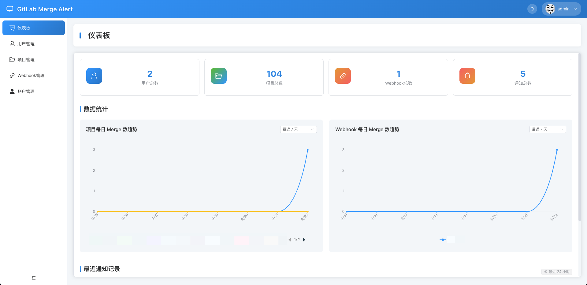
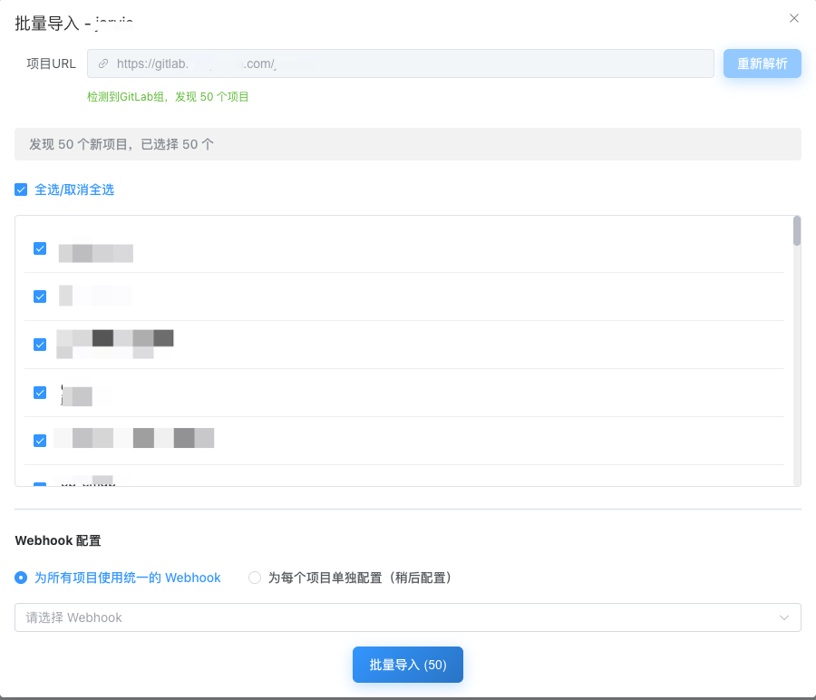

# GitLab Merge Alert

[English](#) | [简体中文](README_zh.md)


**Instant GitLab merge request notifications in WeChat Work** - Never miss a code review again!

## 🎯 What Problem Does It Solve?

If your team uses **GitLab** for code management but **WeChat Work (企业微信)** for daily communication, you've probably faced these issues:

- 😴 **Missed Reviews** - MR notifications buried in emails nobody checks
- 🌍 **Language Barrier** - GitLab notifications are English-only
- 🔌 **No Native Integration** - GitLab supports Slack/Teams but not WeChat Work
- ⏰ **Delayed Feedback** - Code reviews sit idle for hours or days

**GitLab Merge Alert** bridges this gap with instant, localized notifications right where your team already communicates.

## ✨ Key Features

- 🚀 **5-Minute Setup** - Docker deployment with zero dependencies
- 📱 **Native WeChat Work** - Direct robot webhook integration
- 👥 **Smart @Mentions** - Auto-tag reviewers by phone number
- 🎯 **Batch Import** - Import entire GitLab groups at once
- 📊 **Built-in Analytics** - Track team review metrics
- 🔐 **Enterprise Ready** - Admin panel, user management, access control
- 🌐 **Works Everywhere** - GitLab.com or self-hosted instances

## 🖼️ Screenshots

<table>
  <tr>
    <td width="50%">
      
      <p align="center"><b>Analytics Dashboard</b><br/>Real-time metrics and statistics</p>
    </td>
    <td width="50%">
      
      <p align="center"><b>Batch Import</b><br/>Import GitLab groups with one click</p>
    </td>
  </tr>
</table>

## 🚀 Quick Start

### Docker Deploy (Recommended)

```bash
docker run -d \
  --name gitlab-merge-alert \
  -p 1688:1688 \
  -v $(pwd)/data:/app/data \
  -e GMA_GITLAB_URL="https://gitlab.com" \
  -e GMA_PUBLIC_WEBHOOK_URL="https://your-domain.com" \
  -e GMA_ENCRYPTION_KEY="your_32_character_encryption_key" \
  -e GMA_JWT_SECRET="your_strong_jwt_secret" \
  --restart always \
  alfonsxh/gitlab-merge-alert-go:latest
```

### Initial Setup

1. **Access Admin Panel**: Navigate to `http://localhost:1688`
2. **Get Setup Token**: Check container logs for one-time admin token
   ```bash
   docker logs gitlab-merge-alert | grep "Admin setup token"
   ```
3. **Create Admin**: Visit `/setup-admin`, enter token and credentials
4. **Configure**: Add GitLab projects, WeChat Work webhooks, and user mappings

## ⚙️ Configuration

### Environment Variables

| Variable | Description | Default |
|----------|-------------|---------|
| `GMA_GITLAB_URL` | GitLab instance URL | Required |
| `GMA_PUBLIC_WEBHOOK_URL` | Public URL for webhooks | Required |
| `GMA_PORT` | Service port | `1688` |
| `GMA_DATABASE_PATH` | SQLite database path | `/data/gitlab-merge-alert.db` |
| `GMA_ENCRYPTION_KEY` | 32-char encryption key | Auto-generated |
| `GMA_JWT_SECRET` | JWT signing key | Auto-generated |
| `GMA_JWT_DURATION` | Token validity | `24h` |
| `GMA_LOG_LEVEL` | Log level (debug/info/warn/error) | `info` |

> **Note:** `GMA_PUBLIC_WEBHOOK_URL` is the address where the GitLab Merge Alert service is deployed and accessible from GitLab. For example, if the service is deployed on node 192.168.1.63, set `GMA_PUBLIC_WEBHOOK_URL=http://192.168.1.63:1688`

### WeChat Work Robot Setup

1. Create a group in WeChat Work
2. Add a group robot
3. Copy the webhook URL
4. Add to **GitLab Merge Alert** webhooks panel

### Configuration Steps

1. Login to **GitLab Merge Alert** web interface
2. Set up GitLab token in Settings
3. Add WeChat Work webhook URL to notification channels
4. Add projects to monitor
5. The system will automatically configure GitLab webhooks for each project

## 📊 How It Works

```mermaid
graph LR
    A[GitLab MR Event] --> B[GitLab Merge Alert]
    B --> C{Route by Project}
    C --> D[WeChat Work Robot 1]
    C --> E[WeChat Work Robot 2]
    D --> F[@mention Reviewers]
    E --> G[@mention Reviewers]
```

1. **GitLab** sends merge request events via webhook
2. **Service** parses events and identifies target projects
3. **Router** finds mapped WeChat Work webhook
4. **Notifier** builds localized message with @mentions
5. **WeChat Work** delivers notification to team

## 🛠️ Development

### Prerequisites

- Go 1.23+
- Node.js 18+
- Make

### Build from Source

```bash
# Clone repository
git clone https://github.com/Alfonsxh/gitlab-merge-alert-go.git
cd gitlab-merge-alert-go

# Build backend
make install

# Build frontend
make build

# Run
./gitlab-merge-alert
```

## 🤝 Contributing

Contributions are welcome! Please feel free to submit a Pull Request.

1. Fork the repository
2. Create your feature branch (`git checkout -b feature/AmazingFeature`)
3. Commit your changes (`git commit -m 'Add some AmazingFeature'`)
4. Push to the branch (`git push origin feature/AmazingFeature`)
5. Open a Pull Request

## 📋 Roadmap

- [ ] Multiple notification channels (DingTalk, Slack)
- [ ] Custom message templates
- [ ] Notification scheduling and filtering

## ❓ FAQ

**Q: Does it work with GitLab.com?**
A: Yes, it works with both GitLab.com and self-hosted GitLab instances.

**Q: Can I use multiple WeChat Work robots?**
A: Yes, you can map different projects to different robots.

**Q: Is it secure?**
A: Yes, it features encrypted storage, JWT authentication, and webhook signature verification.

## 📄 License

MIT License - see [LICENSE](LICENSE) file for details

## 🙏 Acknowledgments

- [GitLab](https://gitlab.com) for the amazing DevOps platform
- [WeChat Work](https://work.weixin.qq.com) for enterprise communication
- All contributors who help improve this project

## 📞 Support

- **Issues**: [GitHub Issues](https://github.com/Alfonsxh/gitlab-merge-alert-go/issues)
- **Discussions**: [GitHub Discussions](https://github.com/Alfonsxh/gitlab-merge-alert-go/discussions)

---

**Keywords**: GitLab, WeChat Work, 企业微信, Merge Request, Code Review, Notification, Webhook, DevOps, Team Collaboration, GitLab Integration

⭐ **If this project helps your team, please give it a star!**