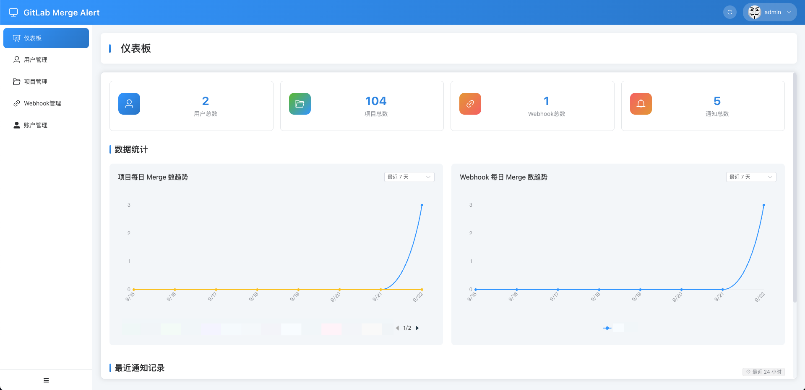

# GitLab Merge Alert

[English](README.md) | [简体中文](#)


[](https://pkg.go.dev/github.com/Alfonsxh/gitlab-merge-alert-go)
[](https://goreportcard.com/report/github.com/Alfonsxh/gitlab-merge-alert-go)
[](https://codecov.io/gh/Alfonsxh/gitlab-merge-alert-go)

**GitLab 合并请求实时推送企业微信** - 再也不会错过代码审查！

## 🎯 解决什么问题？

如果你的团队使用 **GitLab** 管理代码，但用 **企业微信** 进行日常沟通，那你一定遇到过这些痛点：

- 😴 **错过审查** - MR 通知淹没在没人看的邮箱里
- 🌍 **语言障碍** - GitLab 通知全是英文，看着费劲
- 🔌 **没有原生集成** - GitLab 支持 Slack/Teams，就是不支持企业微信
- ⏰ **反馈延迟** - 代码审查一放就是几小时甚至几天

**GitLab Merge Alert** 完美解决这个断层，让通知直达团队日常沟通的地方。

## ✨ 核心功能

- 🚀 **5分钟部署** - Docker 一键启动，零依赖
- 📱 **原生企业微信** - 直接对接群机器人 webhook
- 👥 **智能 @提醒** - 自动通过手机号 @ 审查人
- 🎯 **批量导入** - 一键导入整个 GitLab 组的所有项目
- 📊 **内置统计** - 追踪团队审查效率指标
- 🔐 **企业级** - 完整后台管理、用户权限控制
- 🌐 **全兼容** - 支持 GitLab.com 和自建实例

## 🖼️ 界面预览

<table>
  <tr>
    <td width="50%">
      
      <p align="center"><b>数据仪表盘</b><br/>实时指标和统计分析</p>
    </td>
    <td width="50%">
      
      <p align="center"><b>批量导入</b><br/>一键导入 GitLab 组项目</p>
    </td>
  </tr>
</table>

## 🚀 快速开始

### Docker 部署（推荐）

```bash
docker run -d \
  --name gitlab-merge-alert \
  -p 1688:1688 \
  -v $(pwd)/data:/app/data \
  -v $(pwd)/logs:/logs \
  -e GMA_GITLAB_URL="https://gitlab.com" \
  -e GMA_PUBLIC_WEBHOOK_URL="https://your-domain.com" \
  -e GMA_ENCRYPTION_KEY="your_32_character_encryption_key" \
  -e GMA_JWT_SECRET="your_strong_jwt_secret" \
  --restart always \
  alfonsxh/gitlab-merge-alert-go:latest
```

### 初始化配置

1. **访问管理后台**：打开 `http://localhost:1688`
2. **获取初始化令牌**：查看容器日志获取一次性管理员令牌
   ```bash
   docker logs gitlab-merge-alert | grep "Admin setup token"
   ```
3. **创建管理员**：访问 `/setup-admin`，输入令牌和账号密码
4. **配置系统**：添加 GitLab 项目、企业微信机器人、用户映射

## ⚙️ 配置说明

### 环境变量

| 变量名 | 说明 | 默认值 |
|--------|------|--------|
| `GMA_GITLAB_URL` | GitLab 实例地址 | 必填 |
| `GMA_PUBLIC_WEBHOOK_URL` | 对外可访问的服务地址 | 必填 |
| `GMA_PORT` | 服务端口 | `1688` |
| `GMA_DATABASE_PATH` | SQLite 数据库路径 | `/app/data/gitlab-merge-alert.db` |
| `GMA_ENCRYPTION_KEY` | 32位加密密钥 | 自动生成 |
| `GMA_JWT_SECRET` | JWT 签名密钥 | 自动生成 |
| `GMA_JWT_DURATION` | Token 有效期 | `24h` |
| `GMA_LOG_LEVEL` | 日志级别 (debug/info/warn/error) | `info` |

> **注意：** `GMA_PUBLIC_WEBHOOK_URL` 是 GitLab Merge Alert 服务部署并可从 GitLab 访问的地址。例如，如果服务部署在节点 192.168.1.63 上，设置 `GMA_PUBLIC_WEBHOOK_URL=http://192.168.1.63:1688`

### 企业微信机器人配置

1. 在企业微信创建群聊
2. 添加群机器人
3. 复制 webhook 地址
4. 在 **GitLab Merge Alert** 后台添加

### 配置步骤

1. 登录 **GitLab Merge Alert** Web 界面
2. 注册普通用户时需填写 GitLab Personal Access Token（必须具备 `api`/`read_api`/`read_user` 权限，系统会实时校验并加密保存）
3. 已有账号仍可在设置页更新 GitLab Token
4. 添加企业微信 webhook URL 到通知渠道
5. 添加要监控的项目
6. 系统将自动为每个项目配置 GitLab webhooks

### 多渠道 Webhook 支持

GitLab Merge Alert 现原生支持企业微信、钉钉以及自定义 HTTP Webhook：

- **企业微信**：沿用原生实现，支持手机号 @ 通知，适合中国大陆团队。
- **钉钉**：在 Webhook 表单中选择“钉钉”类型，填写机器人加签 `Secret` 并配置关键词/安全策略；系统内置 20 次/分钟的令牌桶限流与月度配额统计，超过阈值会在通知记录中提示。
- **自定义 Webhook**：选择“自定义”类型后，平台仅记录地址及 Header，消息需直接在 GitLab 配置同一地址触发，适合联动内部系统或第三方告警平台。

> 默认开启自动识别：粘贴 URL 时会根据域名自动判定类型，仍可在对话框中手动切换。

### 钉钉机器人配置要点

1. 在钉钉开放平台创建自定义机器人，启用至少一种安全策略（关键词、加签或 IP 白名单）。
2. 若启用加签，将生成的 `Secret` 填入 GitLab Merge Alert 表单，系统会自动拼接时间戳和签名。
3. 可在“安全关键词”字段添加机器人配置的关键词，平台会在消息模板末尾附带提醒，避免发送失败。
4. 如需调整限流或月度配额，可在配置文件/环境变量中覆盖：
   - `notification.dingtalk.rate_limit_per_minute`（默认 20）
   - `notification.dingtalk.monthly_quota`（默认 5000）
   - `notification.dingtalk.request_timeout`、`notification.dingtalk.retry_attempts`

### 查看与管理渠道配置

Webhook 管理页面新增类型标签与动态表单：

- 选择渠道后会显示特定的说明与校验（例如钉钉加签、关键词提示）。
- 自定义渠道支持维护额外 Header，便于记录在 GitLab 需同步的请求头。
- 项目与账户授权页面同步展示渠道类型，方便管理员快速识别通知路径。


## 📊 工作原理

```mermaid
graph LR
    A[GitLab MR 事件] --> B[GitLab Merge Alert]
    B --> C{按项目路由}
    C --> D[企业微信机器人 1]
    C --> E[企业微信机器人 2]
    D --> F[提醒审查人]
    E --> G[提醒审查人]
```



1. **GitLab** 通过 webhook 推送合并请求事件
2. **服务** 解析事件，识别目标项目
3. **路由器** 查找项目对应的企业微信 webhook
4. **通知器** 构建本地化消息，包含 @提醒
5. **企业微信** 推送通知到团队群


## 🛠️ 开发指南

### 环境要求

- Go 1.23+
- Node.js 18+
- Make

### 源码构建

```bash
# 克隆仓库
git clone https://github.com/Alfonsxh/gitlab-merge-alert-go.git
cd gitlab-merge-alert-go

# 安装依赖
make install

# 构建包含前端的后端二进制
make build

# 运行
./bin/gitlab-merge-alert-go
```

## 🤝 贡献指南

欢迎贡献代码！请随时提交 Pull Request。

1. Fork 本仓库
2. 创建特性分支 (`git checkout -b feature/AmazingFeature`)
3. 提交改动 (`git commit -m 'Add some AmazingFeature'`)
4. 推送到分支 (`git push origin feature/AmazingFeature`)
5. 提交 Pull Request

## 📋 路线图

- [ ] 多渠道通知（钉钉、Slack）
- [ ] 自定义消息模板
- [ ] 通知调度和过滤

## ❓ 常见问题

**Q: 支持 GitLab.com 吗？**
A: 支持，同时支持 GitLab.com 和自建 GitLab 实例。

**Q: 可以使用多个企业微信机器人吗？**
A: 可以，不同项目可以映射到不同的机器人。

**Q: 安全性如何？**
A: 采用加密存储、JWT 认证、webhook 签名验证等安全措施。

## 📄 许可证

MIT 许可证 - 详见 [LICENSE](LICENSE) 文件

## 🙏 致谢

- [GitLab](https://gitlab.com) 提供优秀的 DevOps 平台
- [企业微信](https://work.weixin.qq.com) 提供企业通讯服务
- 所有帮助改进本项目的贡献者

## 📞 支持

- **Issues**: [GitHub Issues](https://github.com/Alfonsxh/gitlab-merge-alert-go/issues)
- **讨论**: [GitHub Discussions](https://github.com/Alfonsxh/gitlab-merge-alert-go/discussions)

---

**关键词**: GitLab, 企业微信, WeChat Work, Merge Request, 代码审查, 通知, Webhook, DevOps, 团队协作, GitLab 集成

⭐ **如果这个项目对你的团队有帮助，请给个 Star！**
